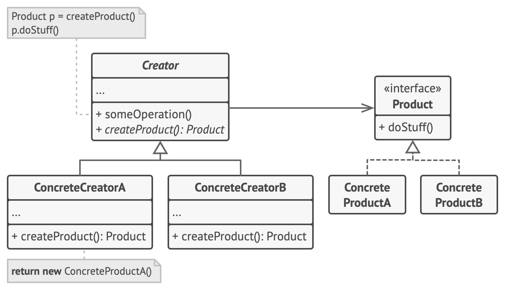

# Factory Method[¹]

- Define an interface for object creation.
- Provides different ways to define the object to be returned.

## Intent

### Problem

- Code dependency of no-general entity classes.
- Uncentralized creation of specialized entities.

### Solution

- Separates the object creation from other logics.
- Replaces the object creation by _Factory_ method.
- The Factory returns a _Product_ object of appropriate type and with correct parameters.

## Motivation

- Decouple the _Product_ creation from _Product_ logic.
- Make easy the implementation of new _Products_.

## Structure

1. The _Product_ declares the interface (_Abstract Products_), which is common to all objects that can be produced by the creator and its subclasses.
2. _Concrete Products_ are different implementations of the product interface.
3. The _Creator_ class declares the factory method that returns new product objects.
   1. The factory method returns a _Product Interface_.
   2. The factory method can be implemented by inheritance (overriding an abstract method from base class) or decision tree (processing parameters to define _Product_ type)
   3. _Product_ creation is not the primary responsibility of the creator.
   4. _Products_ can be created or reused from cache or _Product Pool_.

## Applicability

- Use the Factory Method when you don’t know beforehand the exact types and dependencies of the objects your code should work with.
- Use the Factory Method when you want to provide users of your library or framework with a way to extend its internal components.
- Use the Factory Method when you want to save system resources by reusing existing objects instead of rebuilding them each time (_Product Pool_).

## Implementation steps

1. Make all products follow the same interface. This interface should declare methods that make sense in every product.
2. Add an empty factory method inside the creator class. The return type of the method should match the common product interface.
3. In the creator’s code find all references to product constructors. One by one, replace them with calls to the factory method, while extracting the product creation code into the factory method.
4. Now, create a set of creator subclasses for each type of product listed in the factory method. Override the factory method in the subclasses and extract the appropriate bits of construction code from the base method.
5. If there are too many product types and it doesn’t make sense to create subclasses for all of them, you can reuse the control parameter from the base class in subclasses.
6. If, after all of the extractions, the base factory method has become empty, you can make it abstract. If there’s something left, you can make it a default behavior of the method.

## Pros and Cons

| Pros                                                                | Cons                                  |
| ------------------------------------------------------------------- | ------------------------------------- |
| Avoid tight coupling between the creator and the concrete products. | The code may become more complicated. |
| Single Responsibility Principle.                                    | -                                     |
| Open/Closed Principle.                                              | -                                     |

## Code Examples

[¹]: ../references.md
